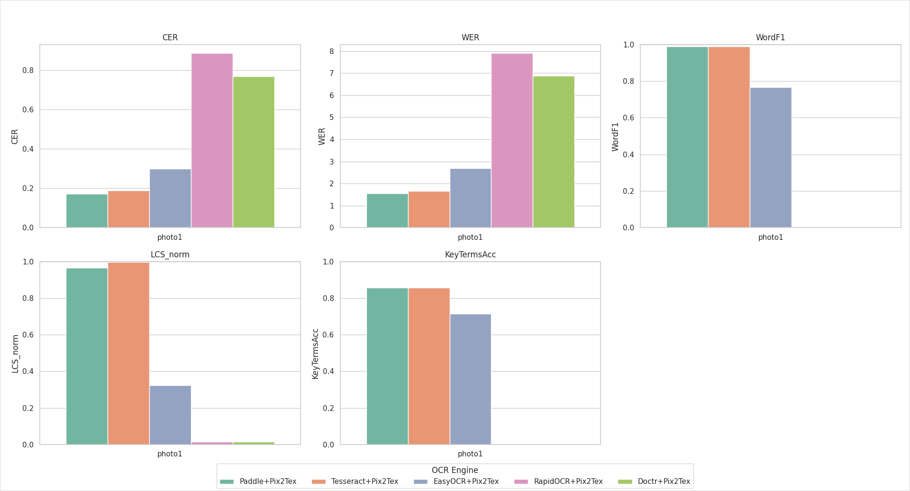

# Официальный отчёт по результатам тестирования OCR-движков с помощью метрик

**Дата:** 15 марта 2026

**Автор:** Ксения

---

## 1. Использованные движки

* Paddle + Pix2Tex
* Tesseract + Pix2Tex
* EasyOCR + Pix2Tex
* RapidOCR + Pix2Tex
* Doctr + Pix2Tex

> Примечание: в отчёте каждая связка представлена в виде «OCR-движок + Pix2Tex» (распознавание текста + извлечение формул).

---

## 2. Краткое резюме (Executive summary)

* По большинству числовых метрик (CER, WER, WordF1, LCS_norm) лидируют **Tesseract+Pix2Tex** и **Paddle+Pix2Tex**.
* **Tesseract+Pix2Tex** демонстрирует небольшое преимущество по LCS_norm и по распознаванию ключевых терминов.
* Несмотря на это, **Paddle+Pix2Tex** оценивается как предпочтительная связка с практической точки зрения ввиду более стабильной и удобной работы с формулами.
* Остальные связки (особенно RapidOCR+Pix2Tex и Doctr+Pix2Tex) показывают существенно худшие результаты по распознаванию обычного текста (очень высокий CER/WER, WordF1 = 0).
---
## 3. Таблица метрик (по одному фото: `photo1`)

| Engine (связка)   |      CER |  WER | WordPrecision | WordRecall |   WordF1 | LCS_len | LCS_norm | FormulaAcc | KeyTermsAcc |
| ----------------- | -------: | ---: | ------------: | ---------: | -------: | ------: | -------: | ---------: | ----------: |
| Paddle+Pix2Tex    | 0.172646 | 1.56 |          0.98 |        1.0 | 0.989899 |     430 | 0.964126 |        1.0 |    0.857143 |
| Tesseract+Pix2Tex | 0.188341 | 1.66 |          0.98 |        1.0 | 0.989899 |     444 | 0.995516 |        1.0 |    0.857143 |
| EasyOCR+Pix2Tex   | 0.298206 | 2.68 |          0.62 |        1.0 | 0.765432 |     144 | 0.322870 |        1.0 |    0.714286 |
| RapidOCR+Pix2Tex  | 0.885650 | 7.90 |          0.00 |        1.0 | 0.000000 |       7 | 0.015695 |        1.0 |    0.000000 |
| Doctr+Pix2Tex     | 0.769058 | 6.88 |          0.00 |        1.0 | 0.000000 |       7 | 0.015695 |        1.0 |    0.000000 |
---

## 4. Объяснение метрик

1. **CER (Character Error Rate)** — доля ошибочно распознанных символов в тексте.

   * Значение 0 → идеальное распознавание.
   * Чем выше, тем больше ошибок на уровне символов.

2. **WER (Word Error Rate)** — доля ошибочно распознанных слов.

   * Учитывает вставки, пропуски и замены слов.
   * Чем меньше, тем лучше.

3. **WordPrecision** — точность распознавания слов.

   * Доля правильно распознанных слов среди всех предсказанных.
   * 1.0 = все распознанные слова правильные.

4. **WordRecall** — полнота распознавания слов.

   * Доля правильно распознанных слов среди всех слов эталона.
   * 1.0 = все слова эталона найдены.

5. **WordF1** — гармоническое среднее WordPrecision и WordRecall.

   * Показывает общий баланс между точностью и полнотой.

6. **LCS_len (Longest Common Subsequence length)** — длина наибольшей общей подпоследовательности символов между предсказанием и эталоном.

   * Позволяет оценить, насколько текст совпадает по структуре символов.

7. **LCS_norm** — нормированное значение LCS_len (от 0 до 1).

   * 1 → полный матч текста.

8. **FormulaAcc** — точность распознавания формул.

   * 1 → все формулы распознаны полностью правильно.

9. **KeyTermsAcc** — точность распознавания ключевых терминов (специфические слова, важные для семантики).

   * 0 → все ключевые термины потеряны; 1 → все распознаны.

---

## 5. Подробный разбор по метрикам

### 5.1 CER / WER / WordF1

* **Paddle+Pix2Tex** и **Tesseract+Pix2Tex** находятся в лидерах по низкому CER и низкому WER, а также по высокому WordF1 (~0.99) — это указывает на корректное распознавание большинства слов и символов.
* **EasyOCR+Pix2Tex** заметно отстаёт: CER и WER выше, WordF1 существенно ниже (≈0.77).
* **RapidOCR+Pix2Tex** и **Doctr+Pix2Tex** демонстрируют крайне плохие показатели качества текста (CER ≈0.77–0.89, WordF1 = 0).

### 5.2 LCS (длина наибольшей общей подпоследовательности)

* **Tesseract+Pix2Tex** имеет наибольшее значение LCS_len и наилучшее нормированное значение LCS_norm (0.9955).
* **Paddle+Pix2Tex** также даёт высокий LCS_norm (0.9641), что подтверждает близость результата к эталону.

### 5.3 KeyTermsAcc

* **Paddle+Pix2Tex** и **Tesseract+Pix2Tex** демонстрируют одинаковое значение KeyTermsAcc (0.8571)
* **EasyOCR+Pix2Tex** имеет 0.7143, а RapidOCR и Doctr — 0.0.

---

## 6. Выводы и интерпретация

1. **Лидеры по числовым метрикам:** Tesseract+Pix2Tex и Paddle+Pix2Tex. По LCS_norm небольшое преимущество у **Tesseract+Pix2Tex**, но практическое качество работы с формулами выше у **Paddle+Pix2Tex**.
2. **Формулы:** по заявленной числовой метрике формул все связки показывают идеальный результат (FormulaAcc = 1.0).
3. **Причина использования PaddleOCR в проекте:** хотя по ряду численных показателей **Tesseract+Pix2Tex** имеет небольшое преимущество, **между Paddle+Pix2Tex и Tesseract+Pix2Tex первая связка (Paddle+Pix2Tex) предпочтительнее**, поскольку в практических условиях она демонстрирует более стабильную работу с формулами и лучшую интеграцию в пайплайн.
4. **Отдельно:** RapidOCR и Doctr показали крайне низкое качество распознавания текста и не рекомендуются к использованию с кириллицей
